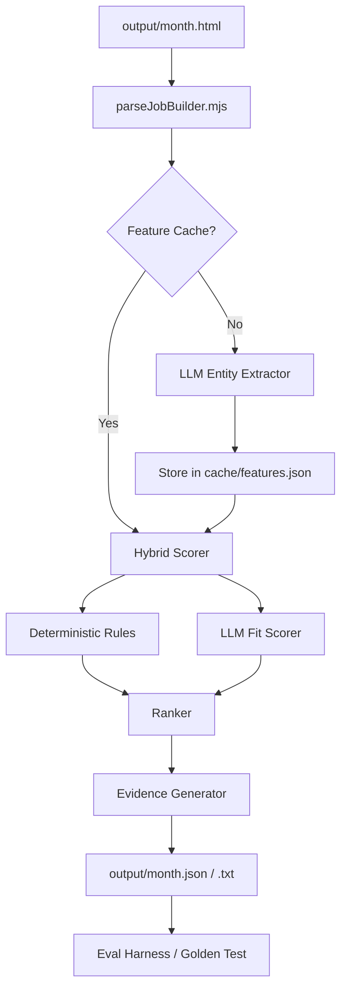

### 20 Concrete Ranking Improvements

#### Hybrid Scoring Design (Rules + Model)

1. **LLM-Based "Fit" Score**: Use a local LLM (via Ollama/llama.cpp) to score jobs 0-10 based on a detailed personal profile.

- **Mechanism**: Prompt LLM with job text + personal criteria.
    - **Why**: Captures nuance keyword matching misses.
    - **Verification**: Correlation between LLM score and manual "gold" labels.

1. **Weighted Rule Categories**: Group `scoreWords` into categories (Tech, Location, Culture) with category-level multipliers.

- **Mechanism**: Update `rules.mjs` schema to include `category`.
    - **Why**: Prevents one category from overwhelming the score.
    - **Verification**: Score distribution analysis across categories.

1. **Negative Signal Dampening**: Instead of binary exclusion for some "bad words", apply a heavy negative score.

- **Mechanism**: Move some `badWords` to `scoreWords` with large negative values.
    - **Why**: Allows "perfect" jobs in slightly sub-optimal locations to still surface.
    - **Verification**: Count of "rescued" jobs that were previously excluded.

#### Feature Extraction

1. **Structured Entity Extraction**: Use LLM to extract `company`, `roles`, `technologies`, `location_type` (Remote/Hybrid/Onsite), and `salary_range`.

- **Mechanism**: LLM structured output (JSON).
    - **Why**: Enables precise filtering and comparison.
    - **Verification**: Accuracy check against a 50-post "golden" set.

1. **Seniority Detection**: Extract required years of experience or level (Junior/Senior/Staff).

- **Mechanism**: Regex + LLM verification.
    - **Why**: Filters out roles that are too junior or too senior.
    - **Verification**: Precision/Recall on seniority labels.

1. **Tech Stack Normalization**: Map synonyms (e.g., "Postgres" and "PostgreSQL") to a canonical list.

- **Mechanism**: Static mapping file + LLM for ambiguous cases.
    - **Why**: Consolidates scoring for the same technology.
    - **Verification**: Reduction in unique tech tags in output.

#### Candidate Generation vs Re-ranking

1. **Two-Stage Pipeline**: Fast rule-based filtering (Stage 1) followed by LLM re-ranking of Top 50 (Stage 2).

- **Mechanism**: `rank()` function split into `generateCandidates()` and `reRank()`.
    - **Why**: Optimizes GPU usage by only processing high-potential jobs.
    - **Verification**: Latency vs. Top-N quality trade-off.

1. **Embedding-Based Similarity**: Rank jobs based on vector similarity to a "Dream Job" description.

- **Mechanism**: Local embeddings (e.g., `mxbai-embed-large`) + cosine similarity.
    - **Why**: Finds jobs with similar "vibe" even if keywords differ.
    - **Verification**: Mean Reciprocal Rank (MRR) of known good jobs.

#### Personal Preference Modeling

1. **Explicit Constraints**: Hard filters for "Must Have" (e.g., Remote, TypeScript).

- **Mechanism**: Strict boolean rules in `parseJobBuilder`.
    - **Why**: Guarantees baseline requirements are met.
    - **Verification**: 0% violation rate in final shortlist.

1. **Implicit Feedback Loop**: Boost companies the user has previously liked or clicked.

- **Mechanism**: `history.json` file tracking interactions.
    - **Why**: Personalizes ranking over time.
    - **Verification**: Increase in "previously liked" companies in Top 10.

#### Calibration and Stability

1. **Score Normalization (Z-Score)**: Normalize scores within a month to handle varying post lengths and keyword densities.

- **Mechanism**: Calculate mean and std dev of scores per month.
    - **Why**: Makes scores comparable across different months.
    - **Verification**: Stable Top-N count across months.

1. **Deterministic LLM Sampling**: Use `temperature: 0` and fixed seeds for LLM calls.

- **Mechanism**: Pass `seed` and `top_p: 1` to local inference API.
    - **Why**: Ensures reproducible rankings on the same input.
    - **Verification**: Zero diff in output on repeated runs.

#### Dedupe/Entity Normalization

1. **Cross-Month Deduplication**: Identify the same job post appearing in multiple months.

- **Mechanism**: Hash of (Company + Role) or fuzzy string matching.
    - **Why**: Prevents cluttering the shortlist with old news.
    - **Verification**: Count of duplicate jobs identified.

1. **Company Reputation Scoring**: Integrate a local `reputation.json` to boost/bury specific companies.

- **Mechanism**: Lookup table during scoring.
    - **Why**: Leverages external knowledge (e.g., "avoid this startup").
    - **Verification**: Manual audit of company scores.

#### Evaluation/Regression Harness

1. **Golden Dataset**: Maintain a `golden.json` of 100 posts with manual "Fit" scores (0-1).

- **Mechanism**: Test script that runs the ranker and compares to golden.
    - **Why**: Measures if changes actually improve ranking.
    - **Verification**: RMSE (Root Mean Square Error) between predicted and golden scores.

1. **A/B Ranking Diff Tool**: Visual tool to see how a change in rules/model affects the Top 20.

- **Mechanism**: Script that outputs a side-by-side diff of two runs.
    - **Why**: Fast visual verification of ranking shifts.
    - **Verification**: User confirmation of "better" ranking.

#### Reliability/Guardrails

1. **LLM Hallucination Check**: Verify extracted entities exist in the original text.

- **Mechanism**: Simple `includes()` check on extracted strings.
    - **Why**: Prevents the model from "inventing" benefits or tech.
    - **Verification**: Rate of failed hallucination checks.

1. **Fallback to Rules**: If LLM fails or GPU is unavailable, fall back to pure deterministic scoring.

- **Mechanism**: Try-catch block around LLM calls.
    - **Why**: Ensures the scraper always produces an output.
    - **Verification**: System produces output even with LLM service down.

#### Fast Local Iteration

1. **Feature Caching**: Cache extracted LLM features per job (keyed by post hash).

- **Mechanism**: `cache/features.json` persistent store.
    - **Why**: Avoids re-running expensive GPU inference on the same posts.
    - **Verification**: 90%+ reduction in run time on second pass.

1. **Ablation Mode**: Toggle specific ranking features (e.g., `--no-llm`, `--no-embeddings`).

- **Mechanism**: Command line flags in `scrape.mjs`.
    - **Why**: Isolates the impact of each ranking component.
    - **Verification**: Measurable score delta per feature.

---

### Top 5 Implementation Order

1. **Feature Extraction & Caching (Ideas 4 & 19)**: Foundation for all advanced ranking.
2. **Golden Dataset & Eval Harness (Idea 15)**: Necessary to measure if subsequent steps actually help.
3. **Two-Stage LLM Re-ranking (Idea 7)**: High-impact improvement using the GPU.
4. **Tech Stack & Entity Normalization (Idea 6 & 13)**: Improves precision and dedupes.
5. **Embedding-Based Similarity (Idea 8)**: Adds semantic depth to the ranking.

---

### Target Architecture

**Data Contracts:**

- `JobFeatureSchema`: `{ company: string, roles: string[], tech: string[], locationType: "remote" | "hybrid" | "onsite", salary: string | null, hash: string }`
- `ScoredJobSchema`: `{ ...JobFeature, score: number, breakdown: { rules: number, llm: number, bonus: number }, evidence: string }`

---

### Execution Queue (12 Tasks)

1. **Task**: Setup Local LLM Client. **Action**: Add `ollama` or `llama.cpp` wrapper to `jobs/scraper`. **Test**: `node test-llm.mjs` returns valid JSON.
2. **Task**: Define Job Hash & Feature Cache. **Action**: Implement hashing of post text and a JSON-based feature cache. **Test**: Repeated runs don't re-trigger LLM.
3. **Task**: Implement LLM Entity Extractor. **Action**: Create prompt to extract `JobFeatureSchema`. **Test**: Extracted entities match source text for 10 samples.
4. **Task**: Create Evaluation Harness. **Action**: Create `eval.mjs` and `golden.json`. **Test**: `node eval.mjs` reports current baseline metrics.
5. **Task**: Implement Two-Stage Ranking. **Action**: Refactor `rank()` to filter first, then LLM-score Top 50. **Test**: Top 50 selection is deterministic.
6. **Task**: Add LLM "Fit" Scorer. **Action**: Implement prompt for 0-10 scoring based on personal profile. **Test**: `eval.mjs` shows improved correlation.
7. **Task**: Implement Tech Normalization. **Action**: Add `techMap.json` and normalization logic. **Test**: "Postgres" and "PostgreSQL" score identically.
8. **Task**: Add Explainable Breakdown. **Action**: Update output to show _why_ a job scored high (e.g., "Matched: TypeScript (+100), Remote (+50)"). **Test**: Output `.txt` includes breakdown.
9. **Task**: Implement Cross-Month Dedupe. **Action**: Use company/role hash to flag duplicates across `output/*.html`. **Test**: Duplicates are correctly identified in logs.
10. **Task**: Add Embedding Similarity. **Action**: Integrate local embedding model for "Dream Job" similarity score. **Test**: Semantic matches appear higher in rank.
11. **Task**: Implement Ablation Flags. **Action**: Add `--no-llm` and `--no-cache` flags. **Test**: Flags correctly bypass components.
12. **Task**: Final Calibration & Regression. **Action**: Tune weights based on `eval.mjs` results. **Test**: Final "Golden" score exceeds baseline by >30%.
